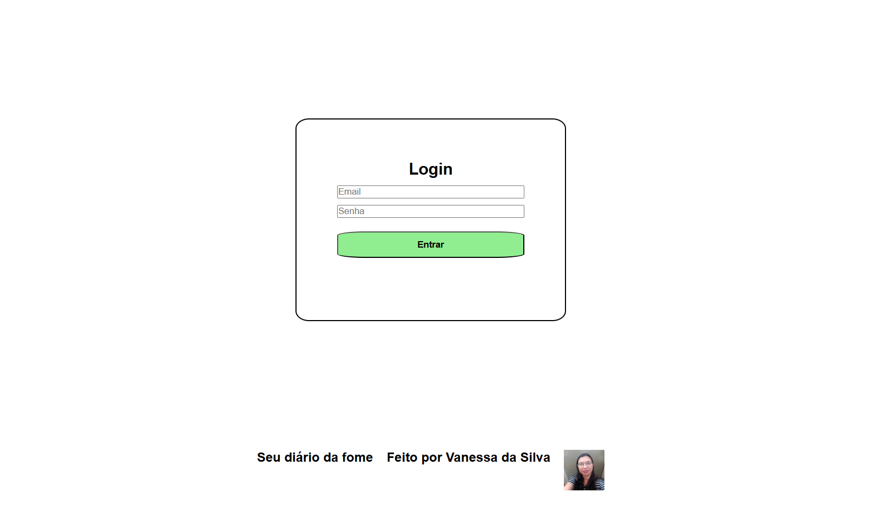
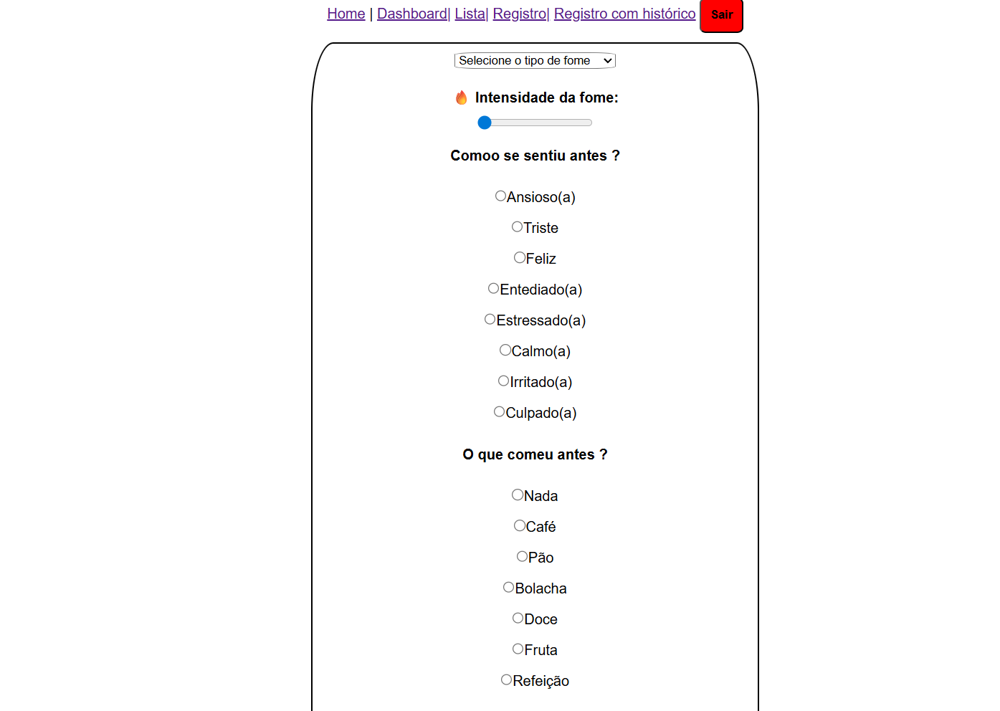
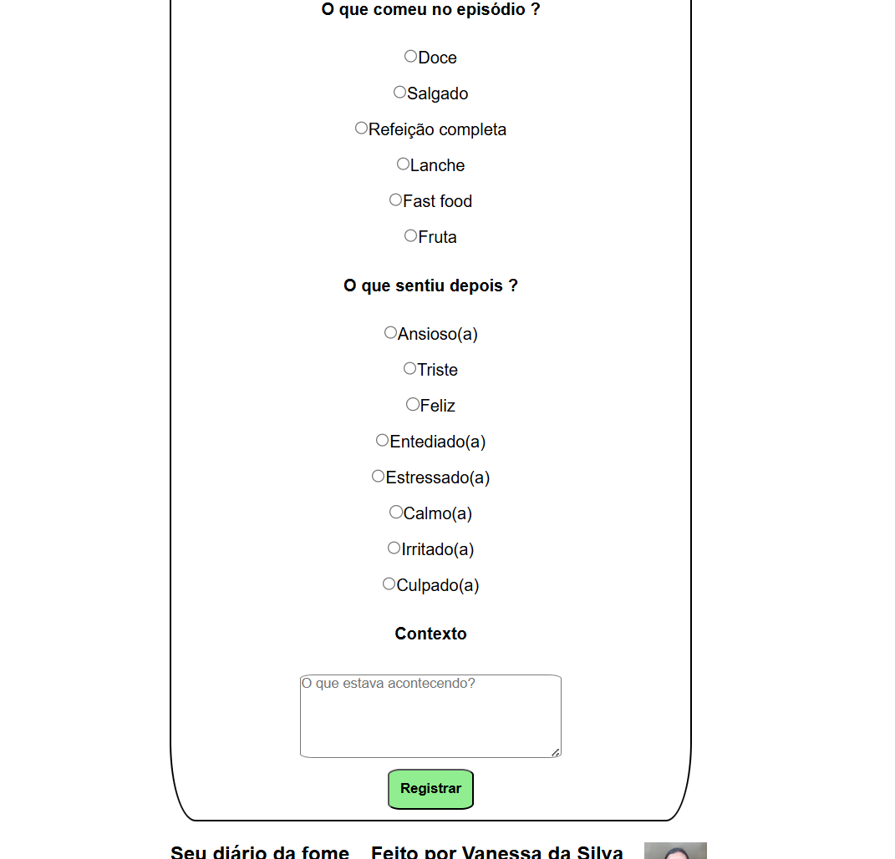
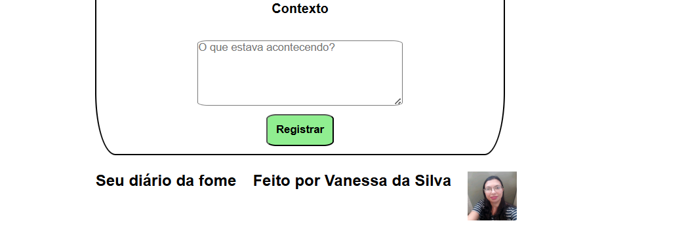
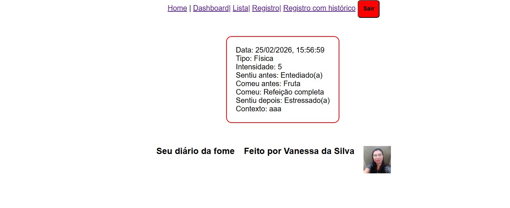
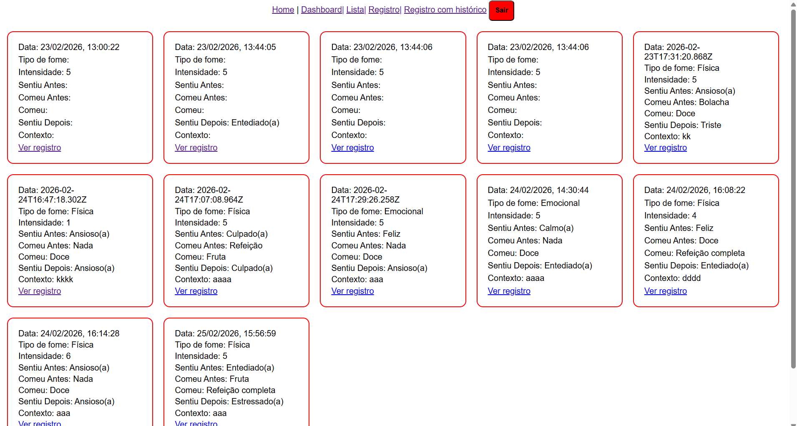

# Diário da Fome Emocional

## Motivação

O **Diário da Fome Emocional** nasceu da necessidade de entender meus próprios padrões alimentares. Muitas vezes, a fome está ligada a emoções ou estresse, e este projeto ajuda a registrar e identificar esses gatilhos.

## Tecnologias

- **React** – interface dinâmica  
- **React Router** – navegação entre páginas  
- **Recharts** – gráficos interativos  
- **CSS puro** – responsividade e estilo  
- **localStorage** – armazenamento local dos registros  

## Como funciona

- Os registros de alimentação são salvos no navegador via `localStorage`.  
- Permite consultar dados e visualizar padrões sem precisar de back-end.  
- Gráficos mostram tendências e ajudam a identificar episódios de fome emocional.  

## Mini Screenshots

### Tela de login

### Tela de Registro

### Tela de item Registro

### Tela lista de registros

### Tela de Gráficos

## Propósito

Projeto pessoal e de portfólio, mostrando habilidades em:

- **React e front-end interativo**  
- **Visualização de dados com gráficos**  
- **Responsividade e experiência do usuário**  
- **Gestão local de dados com localStorage**

Futuras atualizações planejam incluir:

- Back-end seguro para armazenamento real  
- Análises mais avançadas de padrões emocionais  
- Autenticação de usuário e histórico persistente

## Feito por Vanessa da Silva 👩🏻‍💻